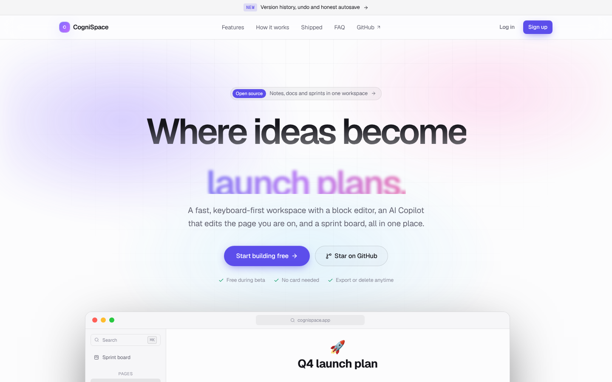
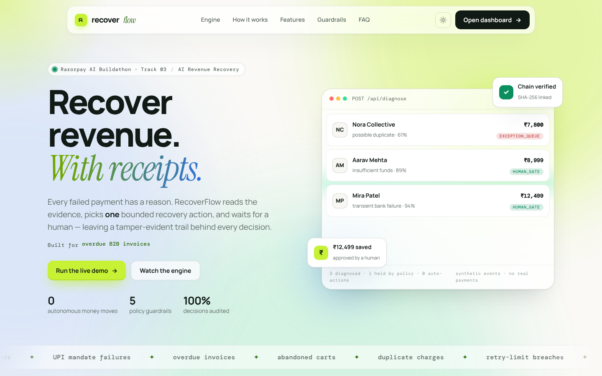

 

## 👋 Hi, I'm Karthik

I'm a **B.Tech CSE (AI/ML)** student at **NIAT, Hyderabad** (2025–2029). I build full-stack, AI-integrated products **end to end** — UI, API, data, deploy — and I ship them live.

I'm looking for **internships at product companies and early-stage startups** (Hyderabad, remote, or San Francisco).

What I care about: products that are honest about what they do. Saves that say "Saved" only when the server confirms. AI output you review before it lands, with undo. Automation with hard safety limits and a paper trail.

## 🚀 Shipped projects

<table>
<tr>
<td width="50%" align="center" valign="top">

 <a href="https://cognispace-sigma.vercel.app"><b>Live demo</b></a> · <a href="https://github.com/karthik1122-code/cognispace"><b>Code</b></a>
</td>
<td width="50%" align="center" valign="top">

 <a href="https://recoverflow-ten.vercel.app"><b>Live demo</b></a> · <a href="https://github.com/karthik1122-code/recoverflow"><b>Code</b></a>
</td>
</tr>
<tr>
<td align="center"></td>
<td align="center"></td>
</tr>
</table>

<b>🧠 CogniSpace — how it works</b>

- **Editor:** TipTap block editor with a `/` menu, toggles, to-dos and a selection toolbar.
- **Copilot:** Gemini responses streamed over SSE. You review, insert, and can undo in one click. AI output is sanitized before it is rendered.
- **Reliability:** autosave only reports *Saved* after the server confirms; offline retries with backoff; version check (optimistic concurrency) with a "load theirs / keep mine" flow.
- **Safety nets:** version history with one-click restore, undo for deletes and AI inserts, JSON export, account deletion.
- **Not yet:** real-time multiplayer — two tabs are detected, but there is no live co-editing.
- **Stack:** React 19, TypeScript, Vite, Tailwind, Framer Motion, Express 5, MongoDB, Gemini. Vercel + Render.

<b>⚡ RecoverFlow — how it works</b>

- **Built for** the Razorpay AI Buildathon, Track 03 (AI Revenue Recovery).
- **Flow:** failed payment → evidence-based diagnosis → policy engine → one bounded action → human approval → audit trail. The AI never moves money on its own.
- **Policy codes:** `NO_CONSENT`, `HIGH_VALUE_REVIEW`, `EXCEPTION_QUEUE`, `LOW_CONFIDENCE`, `HUMAN_GATE`.
- **Security:** HMAC-verified Razorpay webhooks, idempotent processing, hash-chained audit log, strict CSP, only `public/` is served.
- **Quality:** zero runtime dependencies, 20 passing tests, a 21-scenario held-out evaluation suite, CI on every push.
- **Honest limits:** demo data is synthetic and Razorpay is Test Mode only.

**Also built:** [Nimbus](https://github.com/karthik1122-code/nimbus) (AI analytics product site, front-end showcase with simulated data) · [Balaji Family Dhaba](https://github.com/karthik1122-code/balaji-chilukur-family-dhaba) ([live](https://balaji-chilukur-family-dhaba-fawn.vercel.app), digital menu site)

## 🛠️ Toolbox

## 🧭 Experience

| When | What |
|---|---|
| Aug–Sep 2024 | **IoT & Robotics Trainee, T-Works** — AI-based smart street lights |
| Apr–Jul 2024 | **Student Intern, Airbac Labs** — machine learning for stock prediction |
| Aug 2024 | **Volunteer, Rubaroo** — STEM awareness for 100+ students |

## 🔭 Next up

- **Nudge** — an internship-application tracker for NIAT batchmates.
- **A key-value store in C++** — to go deep on systems fundamentals.

## 📫 Let's talk

If you're a founder or engineer who wants someone who ships, reviews their own work honestly, and learns fast: [LinkedIn](https://www.linkedin.com/in/karthik-uppari-4005a7373) · [upparikarthik505@gmail.com](mailto:upparikarthik505@gmail.com)

Built in public · 2026

